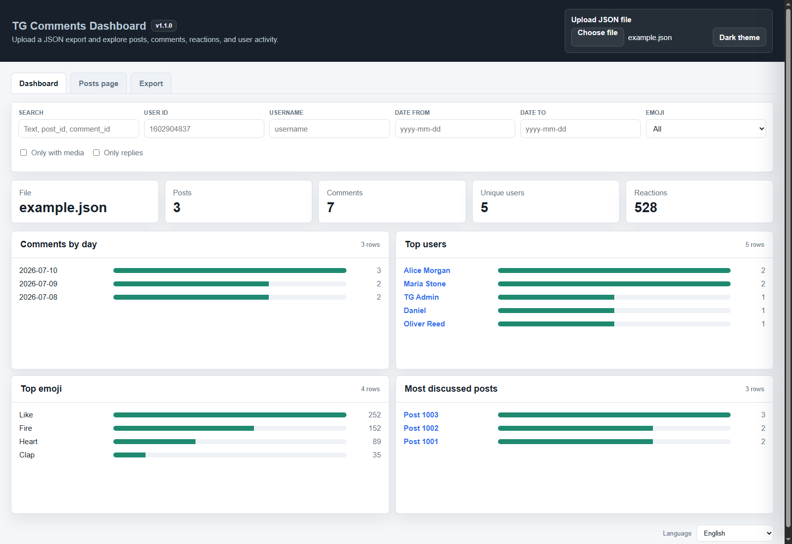
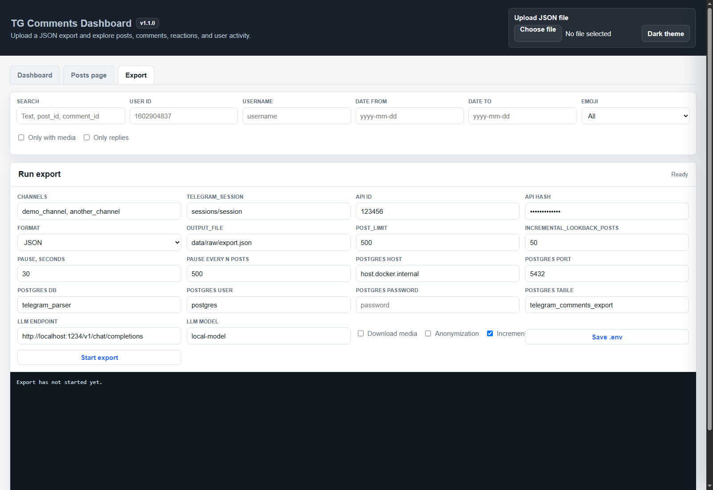

# TG

[Русский](README_ru.md) | [中文](README_cn.md)

TG is a local-first Telegram comments exporter and analytics dashboard. It exports channel posts, discussion comments, reactions, links, optional media files, and can update existing datasets incrementally.



## Features

- Export Telegram channel posts and comments with Telethon.
- Use one or more channels in `CHANNEL`, separated by commas.
- Save exports as `JSON`, `CSV`, `Parquet`, or `PostgreSQL`.
- True incremental export: scan new posts and revisit older exported posts to refresh comments, reactions, and counters.
- Optional media download into `data/content/<dataset_name>/`.
- Optional anonymization of `user_id`, `username`, `first_name`, and `last_name`.
- Web UI on port `9595` with dashboard, post view, comment tree, filters, user profiles, and export launch screen.
- LLM analyzer for exported JSON files with Russian, English, and Chinese prompt files.
- MCP server for local automation through AI clients.
- Docker Compose setup for local use.

## Screenshots

### Dashboard


### Export Screen



## Demo JSON

Use [examples/example.json](examples/example.json) to test the dashboard without connecting to Telegram.

## Project Structure

```text
.
├── main.py                    # Unified CLI: export, analyze, dashboard, config-check, mcp
├── export_comments.py         # Telegram exporter
├── comments_dashboard.html    # Web dashboard
├── web_server.py              # Local web server and export API
├── mcp_server.py              # MCP server for local exports and analysis
├── llm_analyzer.py            # LLM analysis for exported JSON
├── config.py                  # .env/config loader
├── docker-compose.yml         # Docker Compose services
├── anonymizer                 # Aliases for anonymized users
├── prompts/                   # LLM prompt files
├── data/
│   ├── raw/                   # Exported datasets
│   ├── content/               # Downloaded media
│   ├── analysis/              # LLM analysis output
│   └── state/                 # Incremental export state
└── examples/
    ├── example.json
    └── demo_export.json
```

## Requirements

- Docker Desktop, recommended.
- Telegram API credentials: `API_ID` and `API_HASH`.
- A Telegram account session for Telethon.
- Optional: PostgreSQL if you use `postgresql` export.
- Optional: local or remote LLM endpoint if you use `analyze`.

Get Telegram API credentials at `https://my.telegram.org/apps`.

## Configuration

Create `.env` from the example:

```powershell
Copy-Item .env.example .env
```

Edit `.env`:

```env
API_ID=123456
API_HASH=your_api_hash_here
CHANNEL=your_channel,another_channel
TELEGRAM_SESSION=sessions/session
OUTPUT_FILE=data/raw/export.json
POST_LIMIT=500
INCREMENTAL_LOOKBACK_POSTS=50
POSTS_PAUSE_SECONDS=30
POSTS_PAUSE_AFTER_POSTS=500

POSTGRES_HOST=host.docker.internal
POSTGRES_PORT=5432
POSTGRES_DB=telegram_parser
POSTGRES_USER=postgres
POSTGRES_PASSWORD=your_postgres_password_here
POSTGRES_TABLE=telegram_comments_export

LLM_ENDPOINT=http://localhost:1234/v1/chat/completions
LLM_MODEL=local-model
```

Important fields:

- `API_ID`, `API_HASH`: Telegram API app credentials.
- `CHANNEL`: one or more channel usernames or links separated by commas, for example `durov,telegram`.
- `TELEGRAM_SESSION`: Telethon session file path, usually inside `sessions/`.
- `POST_LIMIT`: how many new/latest posts to scan per export run.
- `INCREMENTAL_LOOKBACK_POSTS`: in incremental mode, how many already exported older posts to revisit at or below the saved `last_post_id`.
- `POSTS_PAUSE_SECONDS`: pause duration in seconds.
- `POSTS_PAUSE_AFTER_POSTS`: pause after every N processed posts.
- `OUTPUT_FILE`: base output directory is taken from this path, usually `data/raw/export.json`.
- `LLM_ENDPOINT`, `LLM_MODEL`: used by `analyze`.

## Docker Usage

Start the web UI:

```powershell
docker compose up --build dashboard
```

Open:

```text
http://localhost:9595
```

Run CLI commands:

```powershell
docker compose run --rm cli --help
docker compose run --rm cli config-check
```

## CLI Commands

The project uses one CLI entrypoint:

```text
tg <command> [options]
```

In Docker:

```powershell
docker compose run --rm cli <command> [options]
```

### Export JSON

```powershell
docker compose run --rm cli export json
```

Output example:

```text
data/raw/<channel>_20260710_120000.json
```

### Incremental Export

```powershell
docker compose run --rm cli export json --incremental
```

Incremental mode writes and updates:

```text
data/raw/<channel>_dataset.json
data/state/<channel>_state.json
```

It scans posts newer than the saved `last_post_id` plus `INCREMENTAL_LOOKBACK_POSTS` already exported posts at or below that `last_post_id`. This refreshes counters, reactions, and comments on older posts that changed after a previous run. It merges posts by `post_id`, merges comments by `comment_id`, and keeps already downloaded media files.

### Export With Media

```powershell
docker compose run --rm cli export json --incremental --download-media
```

Media is saved to:

```text
data/content/<channel>_dataset/
```

### Other Export Formats

```powershell
docker compose run --rm cli export csv
docker compose run --rm cli export parquet
docker compose run --rm cli export postgresql
```

PostgreSQL settings are read from `.env`.

### Anonymized Export

```powershell
docker compose run --rm cli export json --incremental --anonymize
```

Aliases are loaded from `anonymizer`. Use `--anonymizer-file <path>` to pass a custom file.

### Analyze Exported JSON With LLM

```powershell
docker compose run --rm cli analyze durov_dataset.json --limit 10
```

Use a built-in prompt language:

```powershell
docker compose run --rm cli analyze durov_dataset.json --limit 10 --language en
docker compose run --rm cli analyze durov_dataset.json --limit 10 --language zh
```

Built-in prompt files:

- `prompts/llm_ru.json`
- `prompts/llm_en.json`
- `prompts/llm_zh.json`

Pass a custom prompt file:

```powershell
docker compose run --rm cli analyze durov_dataset.json --prompt-file prompts/llm_en.json
```

Prompt files are JSON objects with `system` and `user_template` fields. `user_template` must include `{data}`.

Analysis files are saved to:

```text
data/analysis/analysis_<source_file>.json
```

### MCP Server

Run a Model Context Protocol server over stdio:

```powershell
docker compose run --rm -i cli mcp
```

Local Python:

```powershell
python main.py mcp
```

The MCP server exposes tools for local automation:

- `get_config_safe`: read non-secret config values with secrets masked.
- `list_exports`, `get_export_summary`, `get_post`, `search_comments`: inspect JSON exports in `data/raw`.
- `list_analysis_files`, `read_analysis`, `run_analysis`: work with LLM analysis files.
- `start_export`, `get_export_process_status`: start and monitor a Telegram export. `start_export` requires `confirm=true`.

### Run Dashboard

```powershell
docker compose up dashboard
```

The dashboard can:

- upload a JSON file;
- show file name, posts, comments, unique users, reactions;
- draw charts by day, top users, top emoji, discussed posts;
- open a post and show comments as a tree;
- filter by user, date range, emoji, media, and replies;
- open user details;
- edit `.env` settings from the Export tab;
- start exports from the browser and show progress.

## Local Python Usage

If you do not use Docker, install dependencies:

```powershell
pip install -r requirements.txt
```

Run commands:

```powershell
python main.py --help
python main.py config-check
python main.py export json --incremental
python main.py dashboard
python main.py mcp
```

## Data Format

The main JSON format is a list of posts:

```json
[
  {
    "post_id": 101,
    "post_date": "2026-07-10 10:00:00+00:00",
    "post_text": "Post text",
    "post_views": 1200,
    "post_forwards": 10,
    "post_link": "https://t.me/channel/101",
    "post_media": null,
    "post_reactions": [{"emoji": "fire", "count": 12}],
    "comments": [
      {
        "comment_id": 501,
        "comment_date": "2026-07-10 10:05:00+00:00",
        "comment_text": "Comment text",
        "comment_link": "https://t.me/channel/501",
        "comment_media": null,
        "reply_to_msg_id": null,
        "comment_reactions": [],
        "user": {
          "user_id": 1001,
          "username": "alice",
          "first_name": "Alice",
          "last_name": null,
          "bot": false,
          "premium": false
        }
      }
    ]
  }
]
```

When an exporter step fails but partial data can still be saved, posts may include optional `post_media_error` or `export_errors` fields, and comments may include `comment_media_error`.

See [examples/example.json](examples/example.json) for a complete demo file.

## Notes About Telegram Limits

Telegram does not publish one fixed universal limit for every Telethon workflow. The exporter includes pauses and handles `FloodWaitError` by saving already collected data before waiting.

Recommended practice:

- keep `POST_LIMIT` reasonable;
- use incremental export instead of full re-export;
- keep pauses enabled;
- avoid frequent repeated exports of the same large channel;
- do not run many sessions in parallel from the same account.

## Troubleshooting

### Docker Is Not Running

Start Docker Desktop and run again:

```powershell
docker compose up --build dashboard
```

### Missing API_ID Or API_HASH

Check `.env`:

```powershell
docker compose run --rm cli config-check
```

### First Telethon Login

On first run Telethon may ask for phone/login code. The session file is configured with `TELEGRAM_SESSION` and is usually stored in:

```text
sessions/
```

The folder is mounted into Docker, so the session can be reused between runs.

### Parquet Export Fails

Make sure Docker image was rebuilt after dependencies changed:

```powershell
docker compose build --no-cache
```

### PostgreSQL Export Fails

Check:

- `POSTGRES_HOST`
- `POSTGRES_PORT`
- `POSTGRES_DB`
- `POSTGRES_USER`
- `POSTGRES_PASSWORD`
- network access from Docker to PostgreSQL

## Git Ignore Policy

Runtime data is intentionally ignored:

- `.env`
- `sessions/`
- `data/raw/*`
- `data/content/*`
- `data/analysis/*`
- `data/state/*`

Keep secrets, sessions, exported private data, and downloaded media out of Git.
